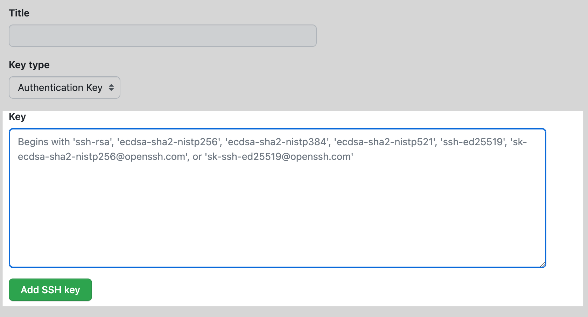

# School_Management_System
[](https://www.python.org/downloads/)
[](https://www.djangoproject.com/download/)


[](https://github.com/prabhu1122/School_Management_Project/stargazers)
[](https://github.com/prabhu1122/School_Management_Project/network)
[](https://github.com/prabhu1122/School_Management_Project/network)

**This project is made for the purpose to manage any school or coaching based system.**

## Table_Of_Contents
1. [About Projects](#about-projects)
   1. [How to install](#how-to-install)
   2. [How to install requirements](#how-to-install-requirements)
2. [Package Required](#package-required)
   1. [List](#list)
   2. [Install Pillow](#install-pillow)
3. [Setup Git on Termux](#setup-git-on-termux)
   1. [Setup External Storage](#setup-external-storage)
   2. [Install Git](#install-git)
   3. [For New repository](#for-new-repository)
   4. [Existing repository](#existing-repository)
4. [Setup SSH publickey](#setup-ssh-publickey)
   1. [About](#about)
   2. [Get Started](#get-started)
   3. [Add to ssh-Agent](#Add-to-ssh-agent)
   4. [Add key To Github](#Add-key-To-Github)
   5. [Testing your SSH connection](#Testing-your-SSH-connection)

## About_Projects
This project is made for the purpose to manage any school or coaching based system

### How to install

To get the project first you log in to your github account.
and go to the link [click here](https://github.com/prabhu1122/School_Management_Project)

### How to install requirements

to download requirements just type following command in your cmd terminal

```
$ pip install -r requirements.txt
```

## Package Required

### List

  `asgiref==3.6.0`              
  `Django==4.1.5`             
  `Pillow==9.1.5`              
  `sqlparse==0.4.3`             
  `tzdata==2022.7`             

### Install pillow

#### install *Pillow:9.4.0*
  

```
$ pip install wheel
```

Then install the libjpeg-turbo package.

```
$ pkg install libjpeg-turbo
```

And now install Pillow with:

LDFLAGS="-L/system/lib/" CFLAGS="-I/data/data/com.termux/files/usr/include/"

```
$ pip install Pillow
```
  
### Setup Git on Termux
Install [Termux](https://termux.com/), launch and update it.

**Update**
```
$ pkg update && pkg upgrade
```
#### Setup External Storage
Create a storage directory to access other areas of the device.
```
$ termux-setup-storage
```

#### Install Python
```
$ pkg install python
```

#### Install Git
```
$ pkg install git
```

**Note:** Go to desired folder which you wants to push/upload to your github accounts

<kbd>or</kbd> just make a directory,

***Example:***
```
$ mkdir test
```

go to dir test 

```
$ cd test
```


**initialise your git file**

```
$ git init
```


you can check you <kbd>.git</kbd> dir by typing

```
$ ls -a
```


### For New repository

```
$ git add . or git add -A
$ git commit -m "first git branch -M main
$ git remote add origin git@gith
$ git push -u origin main
```

### Existing repository

```
$ git remote add origin git@gith
$ git branch -M main
$ git push u origin main
```


## Setup SSH publickey

### About
Using the SSH protocol, you can connect and authenticate to remote servers and services. With SSH keys, you can connect to GitHub without supplying your username and personal access token at each visit. You can also use an SSH key to sign commits.

### Get Started
Open terminal and copy & past the following code

***generate ssh-key***
```
$ ssh-keygen
```
following result will show 

> Generating public/private rsa key pair.
> Enter file in which to save the key (/data/data/
> com.termux/files/home/.ssh/id_rsa):

if you want to save this key to any specific location then 
type that location othervise click <kbd>Enter</kbd> it will create at default
folder in <kbd>~/.ssh</kbd>

> Enter passphrase (empty for no passphrase): [Type a passphrase]
> Enter same passphrase again: [Type passphrase again]```
its up to you if you want and security key during push, pull or any task


**Tips:** Public key generated walahhhhhhhhh

### Add to ssh-Agent

**start ssh-agent**
```
$ eval "$(ssh-agent -s)"

>result >Agent pid 32276
```
**add sshkey to agent**

```
$ ssh-add ~/.ssh/<key_name>
```

##### next
 to check your public key go to your ~/.ssh dir
```
$ cd ~/.ssh && ls
```
then type

```
$ cat id_rsa.pub
```

or skip above both cmd and type 
```
$ cat ~/.ssh/id_rsa.pub
```


copy the entire above <kbd>publickey</kbd>


### Add sshkey To Github

In the upper-right corner of any page, click your profile photo, then click Settings.


Settings icon in the user bar

In the "Access" section of the sidebar, click  **SSH and GPG keys**.


Click **New SSH key** or **Add SSH key**.

SSH Key button


In the *"Title"* field, add a descriptive label for the new key. For example, if you're using a personal laptop, you might call this key "Personal laptop".

Select the type of key, either authentication or signing. For more information about commit signing, see "About commit signature verification."

Paste your key into the *"Key"* field.

The key field


Click **Add SSH key**.


### Testing your SSH connection
```
$ ssh -T git@github.com
```
Success result
```
 >Hi prabhu1122! You've successfully authenticated, 
 >but GitHub does not provide shell access.
```

**Note:** If you are using an aarch64 device, set the LDFLAGS flag to "-L/system/lib64/"


